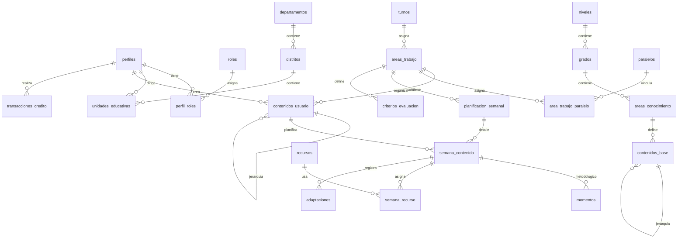

# Documentación de Base de Datos - EduPlan Pro

## 1. Diagrama de Entidad-Relación (ERD)

## 2. Definición de Tablas

### 2.1. Usuarios y Seguridad
- **`perfiles`**: Información extendida de usuarios de Supabase Auth.
- **`roles`**: Catálogo de roles (Administrador, Director, Profesor).
- **`perfil_roles`**: Tabla de unión para asignar múltiples roles a usuarios.

### 2.2. Estructura Organizativa
- **`departamentos`**: Departamentos de Bolivia (ID manual/Código).
- **`distritos`**: Distritos educativos vinculados a departamentos.
- **`unidades_educativas`**: Escuelas/Colegios (ID SIE). *Restricción: Un director por unidad.*

### 2.3. Estructura Académica y Contenidos
- **`niveles` / `grados` / `areas_conocimiento`**: Jerarquía curricular oficial.
- **`contenidos_base`**: Biblioteca oficial de temas y subtemas (Admin).
- **`contenidos_usuario`**: Temas propios o copiados del profesor. *Vinculados a un `area_trabajo_id`.*

### 2.4. Gestión de Aula y Planificación
- **`areas_trabajo`**: El "aula" virtual que vincula Prof. + UE + Especialidad + Turno.
- **`area_trabajo_paralelo`**: Horarios específicos por paralelo en una misma clase.
- **`planificacion_semanal` (CABECERA)**: Metadatos de la semana (fechas, gestión).
- **`semana_contenido` (DETALLE)**: Contenidos específicos para la semana, estados y observaciones.

### 2.5. Apoyo y Evaluación
- **`momentos`**: Etapas metodológicas (Práctica, Teoría, Producción, Valoración) por contenido-semana.
- **`recursos` / `tipos_recurso`**: Materiales bibliográficos o digitales.
- **`criterios_evaluacion`**: Estándares definidos por el profesor para su área.
- **`adaptaciones`**: Registro de ajustes curriculares por contenido-semana.

## 3. Automatización y Lógica

- **Triggers `updated_at`**: Todas las tablas principales actualizan su fecha de modificación automáticamente.
- **Generación de Nombres**: `areas_trabajo` genera su nombre comercial automáticamente (Ej: "UE Simon Bolivar - Secundaria - 6to - Matemáticas").
- **Garantía de Perfil**: El sistema crea automáticamente el perfil y rol de 'Profesor' al primer registro.

## 4. Seguridad (RLS)

- **Aislamiento Total**: Los profesores solo pueden ver y editar sus propias áreas, contenidos y planificaciones.
- **Catálogos Abiertos**: La estructura geográfica (UEs, Distritos) y académica es de libre lectura.
- **Privacidad**: Los créditos y perfiles son estrictamente privados por `auth.uid()`.